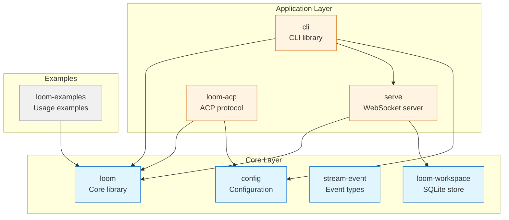

# Module Layout

This document provides a comprehensive overview of the Loom framework's crate architecture, dependencies, and module organization.

## Architecture Overview

Loom is organized as a Cargo workspace with clear separation of concerns: a core library, configuration, CLI, server, protocol implementations, and supporting utilities.

## Crate Dependency Graph



## Crate Summary

| Crate | Purpose | Internal Dependencies | When to Use |
|-------|---------|----------------------|-------------|
| `loom` | Core library: state graphs, agents, tools, LLM | None | Building agents, graphs, custom patterns |
| `config` | Configuration loading (env, TOML, MCP) | None | Loading config, MCP server definitions |
| `stream-event` | Protocol-level event types | None | Serializing events for wire format |
| `loom-workspace` | Workspace/thread management, SQLite | None | Thread persistence, workspace tracking |
| `cli` | CLI parsing and run orchestration | loom, serve, config | Building CLI tools, running agents |
| `serve` | WebSocket server | loom, loom-workspace | Remote agent execution, IDE integration |
| `loom-acp` | Agent Client Protocol (IDE integration) | loom, config | Running as IDE agent (Zed, JetBrains) |

---

## Core Layer

### loom (Core Library)

The heart of the framework. Provides state graphs, agent patterns, tool system, LLM integration, and checkpointing.

**Key modules:**

```rust
loom/
├── graph          // StateGraph, CompiledStateGraph, Node, Next, END, START
├── agent          // ReAct, DUP, ToT, GoT agents
├── llm            // LlmClient trait, LlmResponse, ToolChoiceMode
├── memory         // Checkpointer, Store
├── message        // Message enum (User/Assistant/Tool)
├── tools          // ToolSource, ToolSpec, ToolRegistry
└── channels       // StateUpdater, FieldBasedUpdater
```

**Public API entry points:**

```rust
// State graphs
use loom::graph::{StateGraph, CompiledStateGraph, Node, Next, START, END};

// ReAct pattern
use loom::{ReactRunner, ReactState, build_react_runner};

// Other patterns
use loom::agent::{DupAgent, TotAgent, GotAgent};

// LLM integration
use loom::llm::{LlmClient, LlmResponse, ToolChoiceMode};

// Tools
use loom::tools::{ToolSource, ToolSpec, ToolRegistry};

// Memory
use loom::memory::{Checkpointer, Store};

// Messages
use loom::message::Message;
```

**Example: Building a state graph**

```rust
use loom::graph::{StateGraph, CompiledStateGraph, Node, Next, START, END};
use async_trait::async_trait;
use loom::error::AgentError;

#[derive(Clone, Debug)]
struct MyState {
    value: i32,
}

struct AddNode {
    delta: i32,
}

#[async_trait]
impl Node<MyState> for AddNode {
    fn id(&self) -> &str { "add" }
    
    async fn run(&self, state: MyState) -> Result<(MyState, Next), AgentError> {
        Ok((MyState { value: state.value + self.delta }, Next::Continue))
    }
}

// Build the graph
let mut graph = StateGraph::new();
graph.add_node("add", AddNode { delta: 1 });
graph.add_edge(START, "add")?;
graph.add_edge("add", END)?;

let compiled = graph.compile()?;
let result = compiled.invoke(MyState { value: 0 }).await?;
```

**Source:** `loom/src/lib.rs`

---

### config (Configuration)

Standalone configuration loading from environment, TOML files, and MCP server definitions.

**Key types:**

```rust
// Main entry point
use config::load_config;

// MCP server definitions
use config::{McpConfigFile, McpServerDef, McpServerEntry};

// Provider definitions
use config::ProviderDef;
```

**Priority order:** existing env > `.env` > providers > `config.toml [env]`

**Example: Loading configuration**

```rust
use config::load_config;

// Load from ~/.loom/config.toml and project .env
load_config()?;

// Access env vars (now set in process)
let api_key = std::env::var("OPENAI_API_KEY").ok();
```

**Example: Loading MCP config**

```rust
use config::{discover_mcp_config_path, load_mcp_config_from_path};

if let Some(path) = discover_mcp_config_path() {
    let mcp_config = load_mcp_config_from_path(&path)?;
    for (name, server) in mcp_config.mcp_servers {
        println!("MCP server: {} -> {:?}", name, server);
    }
}
```

**Source:** `config/src/lib.rs`

---

### stream-event (Protocol Events)

Protocol-level event types for wire format serialization. Independent of core loom.

**Key types:**

```rust
use stream_event::{ProtocolEvent, Envelope, EnvelopeState, to_json};
```

**Example: Creating protocol events**

```rust
use stream_event::{ProtocolEvent, Envelope, to_json};

let event = ProtocolEvent::text_delta("Hello, world!");
let envelope = Envelope::new(
    "session-123".to_string(),
    "node-456".to_string(),
    1,
);
let json = to_json(&event, &envelope);
```

**Source:** `stream-event/src/lib.rs`

---

### loom-workspace (Workspace Management)

Workspace and thread association with SQLite-backed storage.

**Key types:**

```rust
use loom_workspace::{Store, StoreError, ThreadInWorkspace, WorkspaceMeta};
```

**Example: Using the store**

```rust
use loom_workspace::Store;

let store = Store::new("workspace.db")?;

// Create workspace
let workspace_id = store.create_workspace("my-project")?;

// Register thread in workspace
store.add_thread_to_workspace("thread-123", &workspace_id)?;

// List threads in workspace
let threads = store.list_threads(&workspace_id)?;
```

**Source:** `loom-workspace/src/lib.rs`

---

## Application Layer

### cli (Command-Line Interface)

CLI parsing and run orchestration. Builds `ReactRunner` from config and executes agents.

**Key types:**

```rust
// Main run function
use cli::{run_agent, RunOptions, RunCmd, RunError};

// Backend abstraction
use cli::{LocalBackend, RunBackend, RunOutput, StreamOut};

// Tool commands
use cli::{list_tools, show_tool, format_tools_list};
```

**Example: Running an agent programmatically**

```rust
use cli::{run_agent, RunOptions, RunCmd};

let options = RunOptions {
    cmd: RunCmd::React,
    message: Some("Hello, agent!".to_string()),
    thread_id: Some("thread-123".to_string()),
    ..Default::default()
};

let result = run_agent(options).await?;
match result {
    RunOutput::Completed { final_state, .. } => {
        println!("Agent completed: {:?}", final_state);
    }
    RunOutput::Interrupted { interrupt, .. } => {
        println!("Agent interrupted: {:?}", interrupt);
    }
    _ => {}
}
```

**Source:** `cli/src/lib.rs`

---

### serve (WebSocket Server)

WebSocket server for remote agent execution using axum.

**Key functions:**

```rust
use serve::{run_serve, run_serve_on_listener};
```

**Example: Starting the server**

```rust
use serve::run_serve;

// Start on default address (127.0.0.1:8080)
run_serve(None, false).await?;

// Start on custom address
run_serve(Some("0.0.0.0:3000"), false).await?;
```

**Example: Testing with random port**

```rust
use serve::run_serve_on_listener;
use tokio::net::TcpListener;

let listener = TcpListener::bind("127.0.0.1:0").await?;
let addr = listener.local_addr()?;
println!("Server listening on {}", addr);

// Run once for single test connection
run_serve_on_listener(listener, true).await?;
```

**Protocol handlers:**

| Request | Response | Description |
|---------|----------|-------------|
| `RunRequest` | `RunStreamEventResponse` + `RunEndResponse` | Execute agent, stream events |
| `ToolsListRequest` | `ToolsListResponse` | List available tools |
| `ToolShowRequest` | `ToolShowResponse` | Show tool details |
| `PingRequest` | `PongResponse` | Health check |

**Source:** `serve/src/lib.rs`

---

### loom-acp (Agent Client Protocol)

ACP implementation for IDE integration via JSON-RPC over stdio.

**Key concepts:**

- **Transport**: stdio (stdin/stdout for JSON-RPC, stderr for logs)
- **Session mapping**: ACP `session_id` maps 1:1 to Loom `thread_id`
- **Trusted mode**: Uses `session/request_permission` for tool confirmation

**Architecture layers:**

1. **Transport**: `run_stdio_loop()` handles JSON-RPC on stdin/stdout
2. **Agent**: `LoomAgent` maps ACP requests to loom execution
3. **Session**: Manages thread_id and checkpointer state

**Example: Running as ACP agent**

```bash
# IDE spawns the process
loom acp

# Communication over stdio:
# <- {"jsonrpc":"2.0","method":"initialize","params":{...},"id":1}
# -> {"jsonrpc":"2.0","result":{...},"id":1}
```

**Supported IDEs:** Zed, JetBrains, any ACP-compatible client

**Source:** `loom-acp/src/lib.rs`

---

## Using the Crates

### When to use which crate

**Building a custom agent:**
```rust
// Use loom directly
use loom::graph::{StateGraph, Node, Next, START, END};
use loom::llm::LlmClient;
```

**Adding CLI support to your application:**
```rust
// Use cli for run orchestration
use cli::{run_agent, RunOptions};
```

**Building a web service:**
```rust
// Use serve for WebSocket server
use serve::run_serve;
// Use loom for agent logic
use loom::{ReactRunner, build_react_runner};
```

**IDE integration:**
```rust
// Use loom-acp for ACP protocol
// Usually spawned by IDE, not used as library
```

**Configuration management:**
```rust
// Use config standalone
use config::load_config;
```

### Dependency guidelines

- **Core crates** (loom, config, stream-event, loom-workspace): No internal dependencies, can be used independently
- **cli**: Depends on core + serve + config; use for CLI applications
- **serve**: Depends on core + loom-workspace; use for servers
- **loom-acp**: Depends on core + config; use for IDE integration

---

## Source Code Structure

```
graphweave/
├── loom/                    # Core library
│   ├── src/
│   │   ├── lib.rs          # Public API, re-exports
│   │   ├── graph.rs        # StateGraph, CompiledStateGraph
│   │   ├── agent/          # Agent patterns
│   │   ├── llm/            # LLM integration
│   │   ├── tools/          # Tool system
│   │   ├── memory/         # Checkpointing
│   │   └── message.rs      # Message types
│   └── Cargo.toml
│
├── config/                  # Configuration
│   ├── src/
│   │   ├── lib.rs          # load_config, public API
│   │   ├── mcp_config.rs   # MCP server definitions
│   │   └── xdg_toml.rs     # TOML loading
│   └── Cargo.toml
│
├── stream-event/            # Protocol events
│   ├── src/
│   │   ├── lib.rs          # Public API
│   │   ├── event.rs        # ProtocolEvent
│   │   └── envelope.rs     # Envelope, to_json
│   └── Cargo.toml
│
├── loom-workspace/          # Workspace management
│   ├── src/
│   │   ├── lib.rs          # Public API
│   │   └── store.rs        # SQLite store
│   └── Cargo.toml
│
├── cli/                     # CLI library
│   ├── src/
│   │   ├── lib.rs          # Public API
│   │   ├── run.rs          # run_agent
│   │   ├── backend.rs      # LocalBackend
│   │   └── tool_cmd.rs     # Tool commands
│   └── Cargo.toml
│
├── serve/                   # WebSocket server
│   ├── src/
│   │   ├── lib.rs          # run_serve, public API
│   │   ├── app.rs          # Axum router
│   │   ├── connection.rs   # WebSocket handling
│   │   └── run.rs          # Run request handler
│   └── Cargo.toml
│
├── loom-acp/                # ACP protocol
│   ├── src/
│   │   ├── lib.rs          # Public API, architecture
│   │   └── agent.rs        # LoomAgent
│   └── Cargo.toml
│
└── Cargo.toml               # Workspace root
```

---

## Quick Reference

### Core imports for common tasks

```rust
// State graphs
use loom::graph::{StateGraph, CompiledStateGraph, Node, Next, START, END};

// ReAct agent
use loom::{ReactRunner, ReactState, build_react_runner};

// Tools
use loom::tools::{ToolSource, ToolSpec};

// LLM
use loom::llm::{LlmClient, LlmResponse};

// Memory
use loom::memory::{Checkpointer, Store};

// Configuration
use config::load_config;

// CLI
use cli::{run_agent, RunOptions};

// Server
use serve::run_serve;
```

### Feature flags

| Crate | Flag | Description |
|-------|------|-------------|
| loom | `lance` | LanceDB for vector search |

---

## Summary

The Loom framework follows a layered architecture:

- **Core layer** (loom, config, stream-event, loom-workspace): Independent crates with no internal dependencies
- **Application layer** (cli, serve, loom-acp): Build on core crates for specific use cases

When building with Loom:
- Use `loom` for agent logic and state graphs
- Use `config` for configuration loading
- Use `cli` for command-line tools
- Use `serve` for remote execution
- Use `loom-acp` for IDE integration

Next: [Core Concepts](core-concepts.md) for state management and graph execution.
