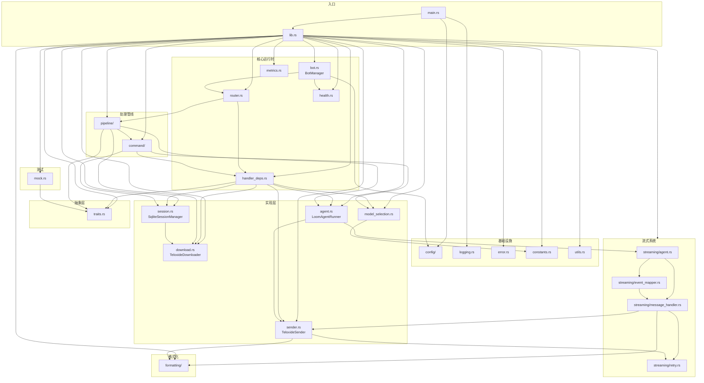
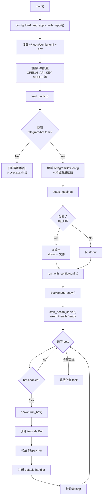
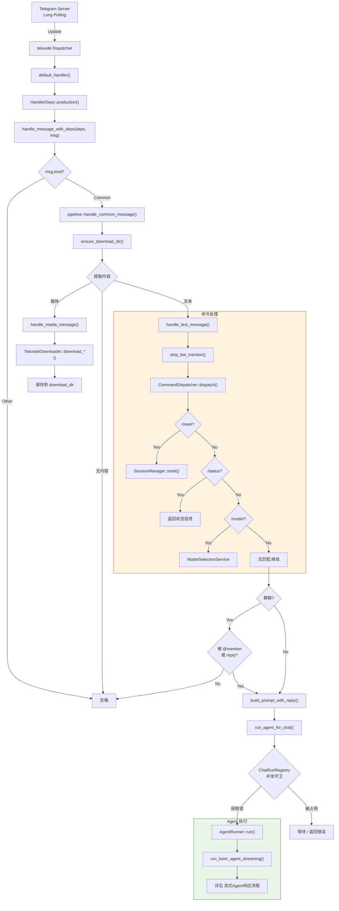
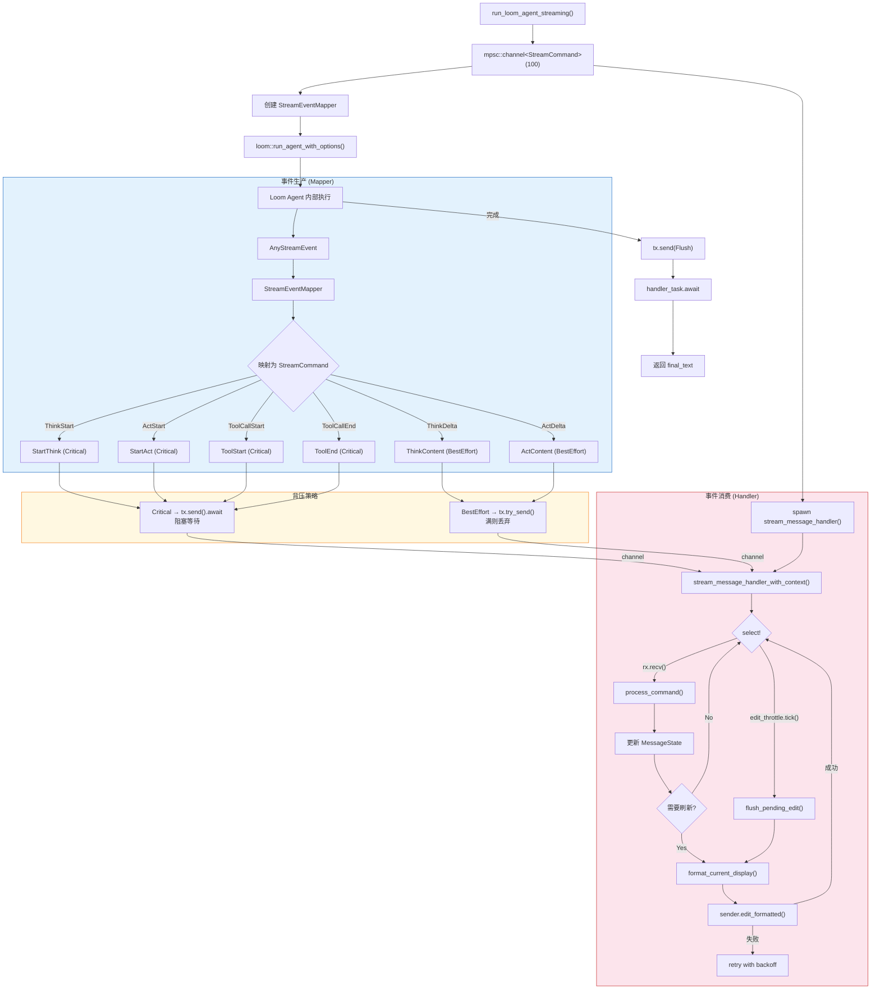
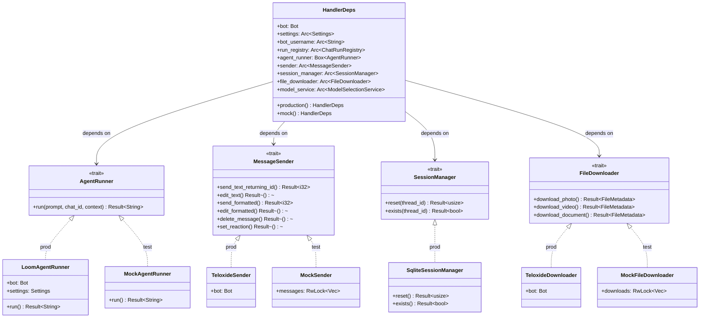
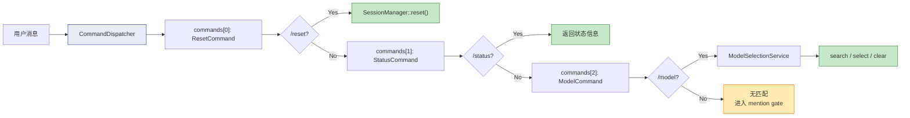
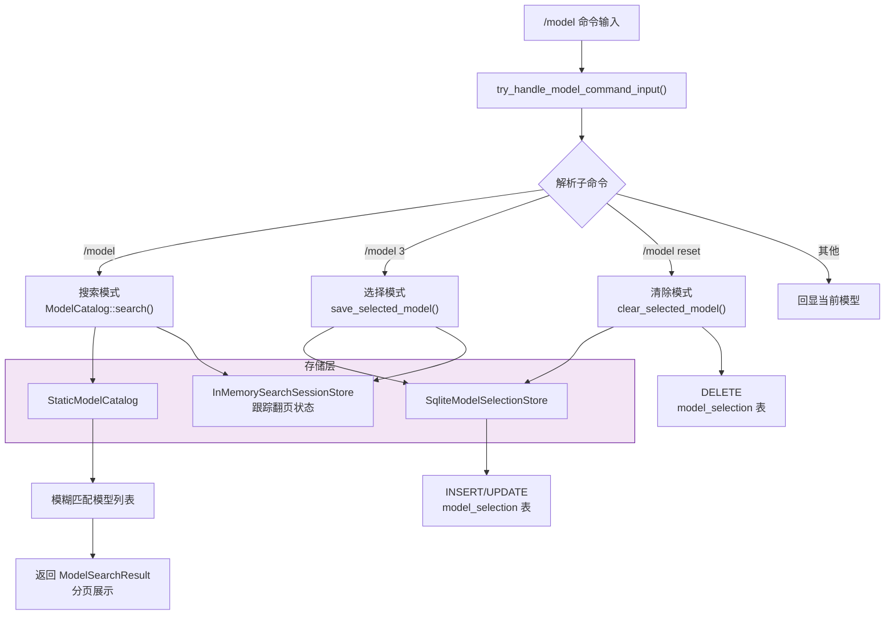
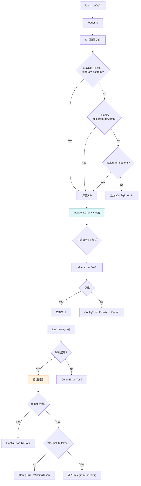
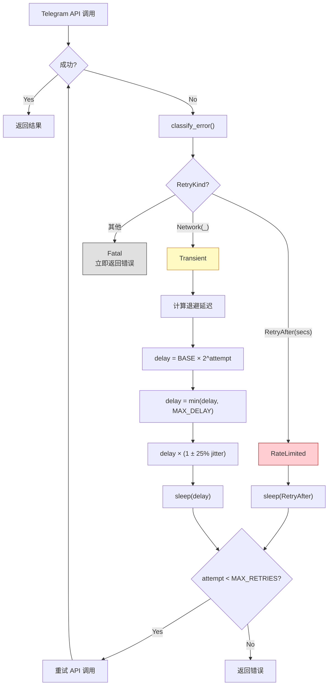

# telegram-bot 架构图与流程图

## 1. 模块依赖关系

---

## 2. 启动流程

---

## 3. 消息处理主流程

---

## 4. 流式 Agent 响应流程

---

## 5. StreamCommand 状态转换

```mermaid
stateDiagram-v2
    [*] --> Idle : 消息到达

    Idle --> Thinking : StartThink
    Thinking --> Thinking : ThinkContent
    Thinking --> Acting : StartAct

    Acting --> Acting : ActContent
    Acting --> ToolExecuting : ToolStart
    ToolExecuting --> Acting : ToolEnd
    Acting --> Thinking : StartThink (新一轮)

    ToolExecuting --> ToolExecuting : ToolStart (嵌套)
    Acting --> Completed : Flush
    Completed --> [*]

    note right of Thinking
        渲染:
        💭 Thinking... (n)
        <累积文本>
    end note

    note right of Acting
        渲染:
        ⚡ Acting... (n)
        <累积文本>
        [Tool blocks]
    end note

    note right of ToolExecuting
        渲染:
        🔧 Tool: <name>
        Running... / Result
    end note
```

---

## 6. 依赖注入与测试切换

---

## 7. 命令分发流程

---

## 8. 模型选择系统

---

## 9. 配置加载流程

---

## 10. 错误重试策略

